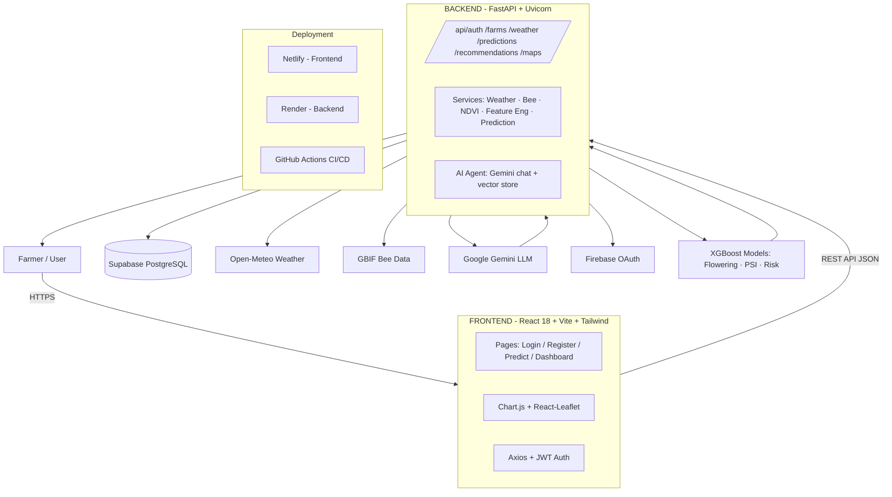

# PolliSync — PPT Architecture Slide Guide

This guide tells you (1) how to lay out your architecture slide, (2) the architecture facts to show, and (3) a copy‑paste prompt to generate a clean architecture diagram image from **Gemini**.

---

## 1. How Your PPT Slide Should Look

### Suggested Slide Layout

```
┌──────────────────────────────────────────────────────────────────┐
│  POLLISYNC — System Architecture                          (Title) │
├──────────────────────────────────────────────────────────────────┤
│                                                                  │
│        (1) USER LAYER   ->  Farmer / Browser (top of diagram)    │
│              │ HTTPS                                            │
│        (2) FRONTEND     ->  React 18 + Vite + Tailwind           │
│              │ REST API (JSON)                                   │
│        (3) BACKEND      ->  FastAPI + Uvicorn                    │
│           /        \          \                                  │
│      (4) Supabase   (5) External APIs   (6) ML Models            │
│          PostgreSQL      Open-Meteo/GBIF/Gemini   XGBoost .pkl   │
│                                                                  │
├──────────────────────────────────────────────────────────────────┤
│  Tech Stack chips:  React • FastAPI • XGBoost • Supabase •       │
│                     Open-Meteo • GBIF • Gemini • Netlify • Render│
├──────────────────────────────────────────────────────────────────┤
│  Footer note: "User selects crop + farm → AI predicts flowering  │
│  window, PSI score & risk → LLM generates farming advice"        │
└──────────────────────────────────────────────────────────────────┘
```

### Slide Design Tips
- **One diagram, one message.** Keep the 6 blocks above; don't add every file name.
- **Layout order = data flow:** top‑down (User → Frontend → Backend → Data/AI).
- **Color‑code layers** (e.g., blue = frontend, orange = backend, green = ML, purple = external/DB) so it reads instantly.
- Use the **diagram image** as the centrepiece (~70% of slide), short bullet takeaway below it.
- 16:9 slide, 32pt title, 14–18pt labels inside diagram.

### Suggested Speaker Bullets (under the diagram)
- "User picks crop + farm location → backend fetches live weather (Open‑Meteo) and bee data (GBIF)"
- "24‑feature vector → 3 XGBoost models predict **flowering window**, **PSI (0–100)**, and **risk level**"
- "Gemini LLM turns results into **plain‑language farming advice**"
- "Data stored in **Supabase PostgreSQL**; frontend on **Netlify**, backend on **Render**"

---

## 2. Architecture Facts (content of the diagram)

| Layer | Components | Responsibility |
|-------|-----------|----------------|
| **User** | Browser / Mobile browser | Farmer interacts with the dashboard |
| **Frontend** | React 18, Vite, Tailwind CSS, Chart.js, React‑Leaflet, Axios | Pages: Landing, Login, Register, Predict, Dashboard. Holds JWT auth state |
| **Backend** | FastAPI + Uvicorn, SQLAlchemy, Pydantic, python‑jose | REST API under `/api` (auth, farms, weather, predictions, recommendations, maps, notifications, agent) |
| **Services** | weather_service, bee_service, environment_service, feature_engineering, prediction_service | Business logic: fetch & cache weather, GBIF bees, NDVI, build 24‑dim feature vector, run ML inference |
| **Database** | Supabase PostgreSQL | Tables: users, farms, predictions, weather_cache, team_members, notifications |
| **External APIs** | Open‑Meteo (weather), GBIF (bee occurrences), Google Gemini (LLM), Firebase (Google OAuth) | Live data + AI generation |
| **ML Models** | XGBoost `.pkl` files (ml/models) | Flowering window (R²=0.9997), PSI score (R²=0.988), Risk classifier (98.4% acc) |
| **AI Agent** | Gemini chat + Supabase vector store | Conversational assistant with knowledge search |
| **Deployment** | Netlify (frontend) + Render (backend) + GitHub Actions CI/CD | Auto‑deploy on push to main |

---

## 3. Copy‑Paste Prompt for Gemini

Paste the block below into Gemini (Gemini 2.5 Flash image / Gemini Pro image or AI Studio), then download the image and drop it into your PPT.

```
Create a clean, professional system architecture diagram for an AI
crop-pollination app called "PolliSync".

STYLE:
- Modern, flat, minimal SaaS-style diagram
- White / very light background
- Colour-coded layers (soft blue = frontend, soft orange = backend,
  soft green = AI/ML, soft purple = external services & database)
- Rounded rectangles, small icons, clear left-to-right or top-to-bottom
  arrows with labels
- Readable 14-16px sans-serif text (no tiny labels)
- 16:9 landscape, high resolution
- NO hand-drawn or sketchy look. No clutter. Group related boxes.

LAYOUT AND CONTENT (top to bottom):

1. USER LAYER
   - Box: "Farmer / User"  → arrow labelled "HTTPS"

2. FRONTEND — React 18 + Vite + Tailwind CSS
   - Sub-items: Pages (Login, Register, Predict, Dashboard),
     Chart.js, React-Leaflet maps, Axios + JWT auth

3. BACKEND — FastAPI + Uvicorn
   - REST API routes: /auth, /farms, /weather, /predictions,
     /recommendations, /maps, /notifications, /agent
   - Services: Weather, Bee (GBIF), Environment (NDVI),
     Feature Engineering (24-dim vector), Prediction
   - AI Agent: Gemini chat + vector store

4. DATA STORE — Supabase PostgreSQL
   - Tables: users, farms, predictions, weather_cache,
     team_members, notifications

5. EXTERNAL APIS (free tier)
   - Open-Meteo (weather)
   - GBIF (bee occurrence data)
   - Google Gemini (LLM recommendations)
   - Firebase (Google OAuth login)

6. ML MODELS — XGBoost (.pkl)
   - Flowering window model
   - Pollination Suitability Index (PSI 0-100)
   - Risk level classifier

7. DEPLOYMENT strip at bottom
   - Netlify → frontend
   - Render → backend
   - GitHub Actions → CI/CD

Draw labelled arrows showing data flow:
User → Frontend → Backend → {Supabase, External APIs, ML Models}
and Backend → Gemini LLM → recommendations back to the dashboard.
```

### If Gemini gives you a Mermaid text diagram instead (not an image)
Reply with: `Now render this exact Mermaid diagram as a polished PNG image for a slide.`

### Optional fallback (Gemini won't draw images)
Paste this Mermaid code into Gemini → "render this as an image", or use
https://mermaid.live → copy the PNG.



---

## 4. Quick Checklist Before You Present
- [ ] Diagram shows the 6 core blocks and the data-flow arrows
- [ ] One‑line takeaway at the bottom ("ML predicts flowering + PSI → LLM gives farming advice")
- [ ] Tech stack chips match slide 2 of your deck
- [ ] Image is high‑res (download PNG from Gemini, not a screenshot)
