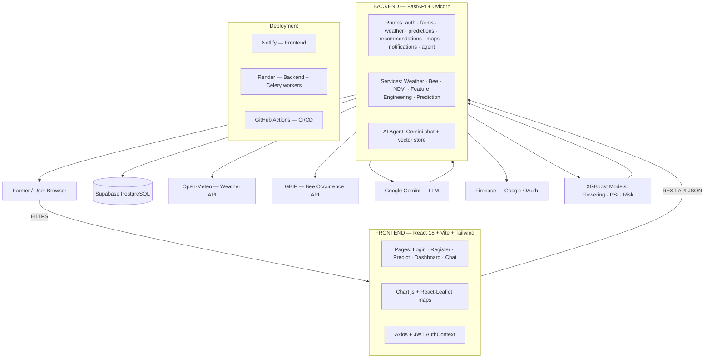

# PolliSync — Complete Project Overview

> **Use this document to build the Round 1 review PPT (10–12 slides).** It contains every fact, metric, and diagram needed. No need to read the codebase.
>
> Target audience: Round 1 reviewers (judges). Style: high-level pitch + demo focus.

---

## 1. Project Intro

**Name:** PolliSync
**Tagline:** *AI-Based Crop Pollination Suitability System*
**One-liner:** An AI-assisted platform for Indian agriculture that predicts crop flowering windows, scores pollination suitability (0–100), and generates actionable LLM-powered farming advice.

**Short pitch (30 sec):**
> PolliSync is a free-tier AI dashboard for Indian farmers. A farmer selects a crop and location, and the system combines live weather, satellite vegetation data, pollinator (bee) observations, and ML models to predict *when* the crop will flower, *how suitable* conditions are for pollination, and *what actions* to take — all explained in plain language by an AI assistant.

---

## 2. Problem Statement

- **~75% of the world's food crops depend on pollination**, and pollinator populations (especially bees) are declining globally.
- Indian farmers often lack **predictive, location-specific pollination guidance**.
- Flowering windows and pollination conditions vary with **weather, temperature, humidity, wind, vegetation health (NDVI), and local bee activity**.
- Farmers make planting and care decisions **without knowing** the best window or the current risk level — leading to lower yields.
- Existing advisory services are either **generic (not crop/location specific)** or **too technical for practical use**.

---

## 3. Solution Overview

PolliSync delivers 4 core outputs for any crop + location:

1. **Flowering Forecast** — ML-predicted flowering window (day-of-year) for the crop.
2. **Pollination Suitability Index (PSI)** — a composite 0–100 score with a risk level (Low / Medium / High).
3. **AI Recommendations** — Gemini-LLM-generated, actionable farming advice (max 200 words, in markdown).
4. **Pollinator Mapping** — interactive map of nearby bee species (GBIF observations within 10 km).

Built as a **student hackathon project** using only free-tier APIs and hosting to deliver a professional, demo-ready product.

---

## 4. Supported Crops & Key Features

**Supported crops (5):** Mustard · Wheat · Sunflower · Rice · Cotton

| # | Feature | Description |
|---|---------|-------------|
| 1 | **Flowering Forecasts** | ML-predicted flowering windows based on weather + satellite (NDVI) + crop GDD phenology |
| 2 | **Pollination Suitability Index** | 0–100 composite score combining temp, humidity, NDVI, bee activity, pollen, wind |
| 3 | **AI Recommendations** | LLM-generated advice tailored to specific crop, location, and current conditions |
| 4 | **Pollinator Mapping** | Interactive Leaflet map of nearby bee species from GBIF within 10 km radius |
| 5 | **Real-Time Weather** | Live weather from Open-Meteo with 1-hour caching for performance |
| 6 | **Responsive Dashboard** | SaaS-style UI: PSI gauge, weather cards, flowering calendar, pollen bars, charts, markdown advice |

---

## 5. System Architecture

### Mermaid diagram



### ASCII fallback

```
  Farmer / Browser
        │ HTTPS
        ▼
  FRONTEND  (React 18 + Vite + Tailwind)
  Pages: Login · Register · Predict · Dashboard · Chat
        │ REST API (JSON)
        ▼
  BACKEND  (FastAPI + Uvicorn)
  Routes: auth · farms · weather · predictions · recommendations · maps · notifications · agent
  Services: Weather · Bee (GBIF) · NDVI · Feature Engineering · Prediction
        │        │              │
        ▼        ▼              ▼
  Supabase   External APIs   XGBoost Models
  PostgreSQL  · Open-Meteo    · Flowering window
  (users,    · GBIF bees      · PSI score
  farms,     · Gemini LLM     · Risk level
  predict.)  · Firebase OAuth
```

### Component breakdown

| Layer | Components | Responsibility |
|-------|-----------|----------------|
| **Frontend** | React 18, Vite, Tailwind CSS, Chart.js, React-Leaflet, Axios | All UI, browser state, JWT auth, charts, maps |
| **Backend** | FastAPI, SQLAlchemy, Pydantic, python-jose, Celery | REST API, business logic, caching, background jobs |
| **Database** | Supabase PostgreSQL | 8 tables: users, farms, predictions, weather_cache, team_members, notifications, notification_preferences, agent_rate_limit |
| **ML** | XGBoost `.pkl` models + StandardScaler | Flowering, PSI, risk predictions |
| **External** | Open-Meteo, GBIF, Google Gemini, Firebase | Weather, bee data, LLM, Google OAuth |
| **Deployment** | Netlify, Render, Supabase, Redis | Hosting + Celery queue/beat |

---

## 6. Tech Stack

| Area | Technologies |
|------|--------------|
| **Frontend** | React 18 · Vite · Tailwind CSS · Chart.js · React-Leaflet · Axios · React Router |
| **Backend** | FastAPI · Uvicorn · SQLAlchemy 2.0 · Pydantic · python-jose (JWT) · Celery + Redis |
| **ML & AI** | XGBoost · Scikit-learn (RandomForest, stacking ensemble) · pandas · joblib |
| **Database** | Supabase PostgreSQL (SQLite for local dev) |
| **External APIs** | Open-Meteo (weather, free, no key) · GBIF (bee occurrences) · Google Gemini (LLM) · Firebase (Google OAuth) · NASA POWER (NDVI fallback) |
| **DevOps** | GitHub Actions (CI/CD) · Netlify · Render · Redis |

---

## 7. How It Works — Data Flow

**Prediction pipeline (end-to-end):**

```
User selects Crop + Farm Location
        │
        ▼
Backend POST /api/predictions
        │
   ┌────┴────┐
   ▼         ▼
Open-Meteo   GBIF
Weather      Bee data
(cache 1hr)  (cache 1wk)
   └────┬────┘
        ▼
Feature Engineering → 24-dim vector
        ▼
   ┌────┴────┐
   ▼         ▼
Flowering   PSI + Risk
Model       Models
(XGBoost)   (XGBoost)
   └────┬────┘
        ▼
Google Gemini LLM → recommendations
        ▼
Response JSON:
flowering window · PSI · risk · weather · bee species · NDVI · AI advice
```

**Key steps:**
1. Weather fetched from **Open-Meteo** (cached 1 hour in DB).
2. Bee species fetched from **GBIF** (cached 1 week, mock fallback per crop).
3. **Feature engineering** builds a 24-dimension vector (7 base weather features + 5 crop one-hots + 4 ecological features + 7 interaction terms).
4. **Three XGBoost models** run inference (scaler transform → predict → post-process).
5. **Gemini LLM** converts numbers into a readable 200-word farming recommendation.
6. Full result snapshot saved to the **predictions** table and shown on the dashboard.

---

## 8. ML Models & Metrics

| Model | Algorithm | Predicts | Performance |
|-------|-----------|----------|-------------|
| **Flowering** | XGBoost Regressor | Day-of-year flowering window | R² = 0.9997, MAE = 0.6 days |
| **PSI** | XGBoost Regressor | Pollination Suitability Index (0–100) | R² = 0.988, MAE = 2.4 |
| **Risk** | XGBoost Classifier | Risk level (Low/Medium/High) | 98.4% accuracy |

**Feature vector (24 dimensions):**
- 7 base: temp_7d_mean, humidity, rainfall_7d, wind_speed, ndvi, day_of_year, month
- 5 crop one-hots: mustard, wheat, sunflower, rice, cotton
- 4 ecological: bee_richness, pollen_tree, pollen_grass, pollen_weed
- 7 interaction terms: temp_humidity, temp_ndvi, humidity_rainfall, bee_pollen, ndvi_bee, wind_humidity, crop_temp

**Training data:** 4,000 flowering + 4,000 PSI samples generated with a **GDD (growing degree days) phenology model** — physically grounded, not random noise.

**Advanced modeling:**
- **Stacking ensemble** (XGBoost + RandomForest + GradientBoosting) → R² = 0.9997
- **Quantile regression** → 80% prediction intervals (11-day width, 78% coverage)
- Hyperparameter tuning via **GridSearchCV**
- **Real-data validation:** R² = 0.924, **93.6% improvement in MAE** over baseline
- 19 model artifacts (`*.pkl`): V1, V2, and Maharashtra-specific variants + scalers

**Quality assurance:** 52 automated regression tests (model loading, feature alignment, prediction bounds, physical sanity — e.g., warmer = earlier flowering).

---

## 9. AI Recommendation Engine

- Uses **Google Gemini** LLM with a carefully engineered **agronomist prompt template** (`ml/prompt_template.txt`).
- Inputs: crop, location, current temperature/humidity/rainfall/wind, predicted flowering window, PSI, risk level, nearby bee species.
- Output: concise, actionable markdown advice (max 200 words) with:
  1. Brief assessment
  2. 2–3 specific actions for the farmer
  3. Warnings when risk is Medium/High
  4. Confidence statement
- **Graceful degradation:** if Gemini is unavailable, a local fallback generates advice so the demo never breaks.
- A **conversational AI agent** (`/api/agent`) also answers farmer questions using Gemini chat + a Supabase vector store (embeddings/knowledge search).

---

## 10. Demo Tour — Key Screens

| Page | What it shows |
|------|---------------|
| **Landing** | Hero, features, supported crops |
| **Login / Register** | Email/password (JWT) + Google OAuth via Firebase |
| **Predict** | Crop + location selector, runs the full pipeline with loading states |
| **Dashboard** | PSI gauge, weather cards, flowering calendar, pollen bars, NDVI card, bee map, AI recommendation |
| **Crop Suitability** | Suitability analysis per crop |
| **Analytics** | PSI history charts, NDVI trends, weather trends |
| **Bee Map** | Interactive Leaflet map of nearby bee species |
| **Farm Management** | Farm CRUD + team members |
| **Chat (Agent)** | Conversational AI assistant with knowledge search |
| **Notifications** | List, read/unread, preferences |
| **Prediction History** | Past predictions |
| **Profile / Settings** | User profile and preferences |
| **Onboarding** | First-run walkthrough |

---

## 11. Database & Backend API

**Database (Supabase PostgreSQL, SQLAlchemy ORM):** 8 tables —
`users`, `farms`, `predictions`, `weather_cache`, `team_members`, `notifications`, `notification_preferences`, `agent_rate_limit`.

**Key relationships:**
- User → many Farms → many Predictions / WeatherCache entries
- Predictions store a full snapshot (flowering, PSI, weather, bees, NDVI, recommendation)

**Backend API route groups (under `/api`):**

| Route group | Purpose |
|-------------|---------|
| `/auth` | Register, login, logout, me, Firebase/Google OAuth |
| `/farms` | Farm CRUD, team members |
| `/districts` | District/location reference data |
| `/weather` | Current weather + forecast |
| `/predictions` | Create prediction, history, dashboard summary |
| `/recommendations` | LLM-generated advice |
| `/maps` | Bee occurrence map data |
| `/notifications` + `/notification-preferences` | Notifications |
| `/team` | Team management |
| `/health` | Health check |

---

## 12. Deployment & DevOps

```
Netlify (frontend)  ── HTTPS REST ──►  Render (backend, FastAPI)
                                          ├── Supabase PostgreSQL
                                          ├── Redis (Celery broker)
                                          ├── Celery worker (async jobs)
                                          └── Celery beat (scheduling)
GitHub Actions CI: frontend build + backend pytest on every push/PR
Main branch → auto-deploy to Netlify + Render
```

- **Netlify** — hosts the React/Vite frontend (auto-deploy on push to main).
- **Render** — hosts the FastAPI backend + Celery worker + beat scheduler.
- **Supabase** — managed PostgreSQL + vector store for the AI agent.
- **Redis** — Celery broker for background tasks.
- **GitHub Actions** — CI runs `npm run build` (frontend) + `pytest` (backend) on every push/PR.

---

## 13. Achievements & Stats (Slide-Friendly)

| Metric | Value |
|--------|-------|
| ML accuracy (flowering / PSI / risk) | R²=0.9997 / R²=0.988 / 98.4% |
| Real-world validation | R²=0.924, 93.6% MAE improvement |
| Training data | 8,000 rows (4K flowering + 4K PSI), GDD-grounded |
| Automated tests | 52 ML regression tests |
| Model artifacts | 19 `.pkl` files (V1/V2/Maharashtra + scalers) |
| Frontend pages | 15 |
| Backend route groups | 10 under `/api` |
| DB tables | 8 |
| External integrations | 5 (Open-Meteo, GBIF, Gemini, Firebase, NASA POWER) |
| Cost | 100% free tier (no paid APIs/hosting) |

---

## 14. Future Scope

- 🚀 **Production deployment** (finish Netlify/Render go-live + integration testing)
- 📍 **Expand geographic coverage** (more states/districts beyond Maharashtra)
- 🌾 **More crops** (pulses, vegetables, orchards)
- 📡 **Real-time IoT sensor data** (soil moisture, local weather stations)
- 📱 **Mobile app / SMS advisory** for farmers without smartphones
- 🧠 **Better LLM grounding** (retrieval-augmented generation over agronomy docs)
- 🤝 **Multi-lingual support** (Hindi/Marathi recommendations)

---

## 15. Team

- Student hackathon project by a **team of 4 SY CSE-AI students**.
- Monorepo with modular boundaries so each member works independently: `frontend/`, `backend/`, `ml/`, `docs/`.

---

## 16. Suggested PPT Outline (12 slides)

> Instructions for the PPT agent — build exactly these slides, in this order, from the sections above.

| Slide | Title | Source section | Key points to show |
|-------|-------|----------------|---------------------|
| 1 | **Title Slide** | §1 | Logo, name, tagline, team, round 1 |
| 2 | **The Problem** | §2 | Pollination crisis stats, farmer pain points, 3 bullet gaps |
| 3 | **Our Solution** | §3 | 4 core outputs (flowering, PSI, AI advice, bee map) |
| 4 | **Key Features** | §4 | Feature table or 6 icon cards + 5 supported crops |
| 5 | **System Architecture** | §5 | Mermaid/ASCII diagram — the big picture |
| 6 | **How It Works** | §7 | Data-flow diagram: crop → weather/bees → ML → LLM → dashboard |
| 7 | **ML Models** | §8 | 3 models + accuracy numbers, 24-dim feature vector |
| 8 | **AI Recommendations** | §9 | Prompt template inputs → outputs, fallback |
| 9 | **Demo** | §10 | 4–6 screenshots (Landing, Predict, Dashboard, Bee Map, Chat) |
| 10 | **Tech Stack & Deployment** | §6, §12 | Stack chips + Netlify/Render/Supabase pipeline diagram |
| 11 | **Results & Future** | §13, §14 | Achievements table + roadmap |
| 12 | **Thank You** | §15 | Team, contact, "questions welcome" |

**Slide design rules:** 16:9 · one idea per slide · big numbers for ML metrics · screenshots on the demo slide · no walls of text.
